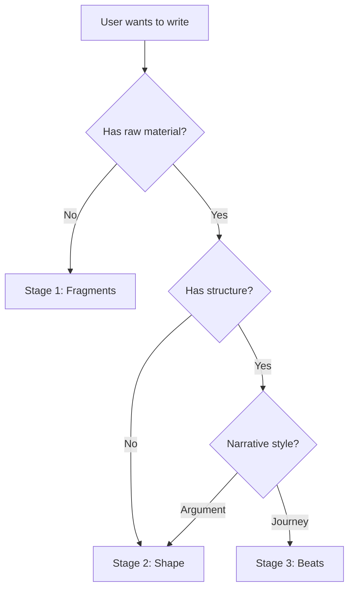

# Writing Pipeline

Three-stage writing workflow. Detect where the user is and route to the right stage.

## Stage Detection



**Auto-route:**
- "fragments", "ideate", "raw material", "挖掘素材" → **Stage 1**
- "shape", "structure", "turn into article", "整理成文" → **Stage 2**
- "beats", "narrative", "journey", "节拍式" → **Stage 3**
- No clear signal → Ask: "你想先挖掘素材、整理结构，还是用节拍式叙事？"

---

## Stage 1: Fragments（素材挖掘）

通过对话挖掘碎片化写作素材。

### 流程

1. **持续访谈**：围绕用户想写的话题进行深度对话，不强加结构
2. **捕捉碎片**：每段有价值的素材立即追加到文档
3. **保持编辑**：每次写入前重新读取文件，保留用户编辑

### 碎片类型

- 锐利的句子（想用但不知放哪）
- 带一句话论据的主张
- 小插曲：事件、代码片段、场景、类比
- 半成品想法："X 的感觉像 Y，以后再展开"
- 引用、对话、偷听到的台词
- 相关观察的集群

### 文件格式

```markdown
# 工作标题

第一个碎片。

---

第二个碎片。

---

> 引用的一句话。

对它的反应。

---

- 相关观察集群
- 按感觉聚合
- 彼此靠近
```

碎片用水平线分隔（`\n---\n`）。正文内无标题、无标签、无顺序。

### 写作节奏

- 静默追加，不打扰对话
- 每次写入前重新读取文件
- 用户可随时说"删掉最后一条"、"重写更锐利"、"合并这两条"

### 完成条件

当用户觉得素材足够时，询问："直接进入整理阶段，还是先休息？"

---

## Stage 2: Shape（结构塑形）

将原始素材塑造成文章。

### 流程

1. **通读素材**：完整读取输入文件，理解内容
2. **起草 2-3 个开头**：每个开头暗示不同的论点或角度，强制用户选择或组合
3. **逐段生长**：问"给定这个开头，读者接下来需要听到什么？"从素材中提取
4. **讨论格式**：每段是段落、列表、表格、引用、代码块？每个格式选择都要有理由
5. **即时追加**：每段达成一致后立即写入文件
6. **循环直到完成**：用户决定何时完成

### 格式选择原则

- **段落 vs 列表**：段落承载论证；列表承载并行项
- **正文 vs 高亮框**：提示、警告、旁白用高亮框（`> [!TIP]`），否则留在正文
- **表格 vs 重复结构**：相同形状重复 3+ 次用表格，否则用加粗引导词的段落
- **引用 vs 转述**：原话是重点时引用，只有想法重要时转述
- **代码块 vs 行内代码**：多行、可运行、示例用块；单个标识符用行内

### 对话技巧

- "这段对读者做了什么上一段没做的？"
- "如果我删掉这段，什么会断？"
- "这是散文还是列表？为什么是散文？"
- "这句话在做两件事——拆开或选一个。"
- "开头承诺了 X，我们漂到了 Y。要么重新穿线，要么改开头。"

### 写作节奏

- 每段达成一致后立即追加
- 每次写入前重新读取文件
- 用户想重写某段时，就地编辑该段，其余不动

---

## Stage 3: Beats（节拍叙事）

以节拍式旅程构建文章，选择冒险风格。

### 流程

1. **起草 2-3 个起始节拍**：从素材中提取不同入口点，展示给用户选择
2. **预览路径**：每个节拍暗示接下来可能的方向
3. **用户选择后**：只写那个节拍，不多写
4. **重新读取**：从磁盘重新读取文章文件
5. **提供 2-3 个下一节拍**：不同方向的转折点
6. **循环直到自然结束**

### 什么是节拍

节拍是旅程中的一次动作。做一件事——设定场景、落地观点、提问、插入旁白、扭转角度。然后停下。

- 一句话（如果这就是全部）
- 一小段（如果需要铺垫）
- 多段（如果是自成一体的小插曲、论证或示例）

如果一个"节拍"需要五段和三个子标题，那是两个节拍粘在一起。拆开。

### 写作规则

- 一次追加一个节拍，不提前写
- 每次写入前重新读取文件，保留用户编辑
- 用户编辑了前面的节拍？让它改变后面的内容
- 用户说"重写那个节拍"或"回到节拍 3 试试别的"？就地编辑，其余不动

### 结束条件

当旅程完成时结束——不是素材用完时。大多数素材会有剩余，那是正常的。

---

## 通用规则

### 文件管理

- 素材文件：只读（Stage 1 产出，Stage 2/3 消费）
- 文章文件：每次写入前重新读取，保留用户编辑
- 路径：用户未指定时询问一次，记住路径

### 阶段切换

- 用户可随时切换阶段："跳过整理，直接用节拍式"
- 切换时保留已有素材，不重新开始
- 从 Stage 1 到 Stage 2/3 时，素材文件自动作为输入

### 写作节奏

- 追加式写入，不批量
- 每次写入前重新读取文件
- 用户编辑优先级最高
